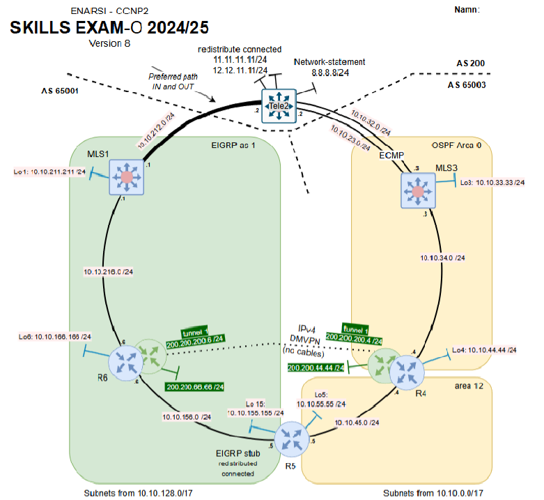

# CCNP Advanced Routing – Enterprise Routing Lab

Practical enterprise routing lab completed as part of the CCNP Enterprise Advanced Routing course.

The lab involved configuring and troubleshooting a multi-protocol routed network using EIGRP, OSPF and BGP across multiple routing domains. The environment also included VRF-Lite, route redistribution, BGP path selection and a DMVPN tunnel.

## Network Topology

The topology consisted of multiple routers and Layer 3 switches divided between EIGRP and OSPF routing domains, with BGP providing external connectivity.

## Technologies

- EIGRP
- EIGRP Stub
- OSPF
- BGP
- VRF-Lite
- Route redistribution
- Administrative Distance
- BGP MED
- Route filtering
- Route summarization
- DMVPN
- IPv4
- SSH

## Configuration Tasks

### VRF-Lite

Configured separate routing instances using VRF-Lite to isolate routing tables and traffic within the network.

### EIGRP

Configured EIGRP within the enterprise network, including:

- EIGRP routing
- EIGRP Stub
- Route advertisement within VRF

### OSPF

Configured OSPF for another part of the network and enabled OSPF operation within the VRF environment.

### BGP

Configured BGP connectivity between multiple autonomous systems.

The BGP configuration included:

- BGP peering
- Address families
- Route summarization
- Network advertisement
- MED-based path selection
- Route filtering

### Route Redistribution

Configured redistribution between multiple routing protocols, including:

- EIGRP to OSPF
- OSPF to EIGRP
- BGP to EIGRP
- BGP to OSPF
- Connected routes to BGP

Administrative Distance was adjusted where necessary to control route selection between competing routing protocols.

### DMVPN

Configured a DMVPN tunnel between two routers using a separate VRF for the tunnel network.

OSPF was used to provide dynamic routing across the DMVPN tunnel.

## Verification and Troubleshooting

Connectivity and routing behavior were verified using routing tables, traceroute and protocol-specific verification commands.

Testing included verifying:

- Routing within VRFs
- BGP path selection
- Route redistribution
- Failover to alternative network paths
- DMVPN operation
- End-to-end connectivity

## Skills Demonstrated

This lab demonstrates practical experience with advanced enterprise routing, multi-protocol network environments, route redistribution, path selection, network segmentation using VRFs and dynamic multipoint VPN technologies.
