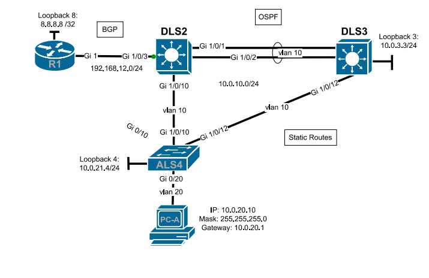

# CCNP Enterprise Core – Practical Network Configuration

Practical network configuration completed as part of the CCNP Enterprise Core course.

The lab involved configuring and troubleshooting a multi-device network using Layer 2 and Layer 3 technologies, dynamic routing protocols and IPv6.

## Network Topology

The network consisted of a router and multiple Layer 3 switches using a combination of switched and routed connections.

## Technologies

- Layer 2 and Layer 3 switching
- VLANs and Switch Virtual Interfaces (SVIs)
- Routed switch ports
- LACP EtherChannel
- Spanning Tree Protocol
- Static routing
- Floating static routes
- OSPF
- BGP
- IPv4
- IPv6
- SSH

## Configuration Tasks

### Switching

Configured VLANs and Layer 3 interfaces across multiple switches.

An LACP EtherChannel was configured between two distribution switches using VLAN 10. Spanning Tree was configured so that the preferred network path remained active while a slower link was available as a secondary path.

### Static Routing

Configured static routing between different parts of the network, including:

- Static routes
- Static default routes
- Floating static default routes for redundancy

### OSPF

Configured OSPF routing including:

- Router IDs
- Network advertisement
- Passive interfaces
- Default route advertisement

### BGP

Configured BGP between the network and an external router.

The configuration included:

- BGP peering
- Address-family configuration
- Network summarization
- Default route advertisement

### IPv6

Configured IPv6 addressing and dynamic IPv6 routing between Layer 3 switches.

### Device Security and Management

Basic device administration and security were also configured, including:

- Encrypted passwords
- SSH version 2
- Disabled Telnet access
- Interface descriptions
- Device hostnames

## Skills Demonstrated

This lab demonstrates practical experience with configuring and troubleshooting enterprise switching and routing technologies in a multi-device network.
