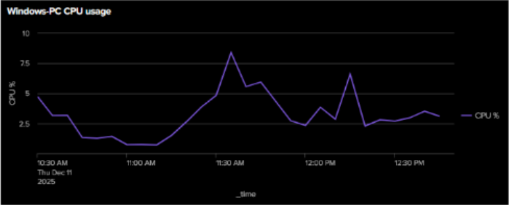
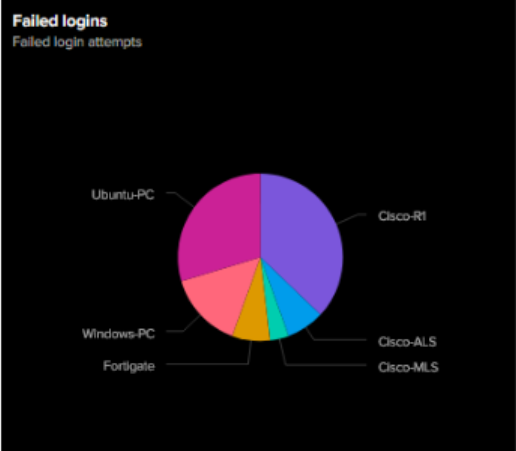

# Splunk Network and System Monitoring

Group project completed as part of the Computer Engineering program at University West.

The project focused on implementing a centralized logging and monitoring solution using Splunk Enterprise in a mixed network environment.

## Project Environment

The lab environment included:

- Splunk Enterprise
- Splunk Universal Forwarder
- Windows 11
- Ubuntu Linux
- Cisco routers and switches
- FortiGate firewall
- Syslog
- Windows Event Logs

Logs and system data from the different devices were collected by a centralized Splunk server and used for monitoring and visualization.

## Splunk Architecture

Splunk Enterprise was used as the central platform for collecting, searching and visualizing log and system data.

Different collection methods were used depending on the monitored system:

- Windows system and event data through Splunk Universal Forwarder
- Network device logs through Syslog
- Linux system data
- Authentication and login events
- System performance metrics

The collected data was then used to create dashboards for infrastructure and security monitoring.

## My Contribution

This was a group project completed together with three other students.

My main responsibilities were focused on the Splunk implementation and included:

- Setting up and configuring Splunk Enterprise
- Configuring Splunk Universal Forwarder for the Windows client
- Collecting Windows system and event data
- Creating Splunk searches for monitoring collected data
- Building dashboards for system and network monitoring
- Creating visualizations for successful and failed login attempts
- Creating Windows CPU and memory monitoring dashboards

## Monitoring Dashboards

Several dashboards were created in Splunk to provide an overview of the monitored infrastructure.

### Windows CPU Monitoring

System performance data from the Windows client was collected using Splunk Universal Forwarder and visualized in Splunk.

The dashboard provided visibility into Windows CPU utilization and system performance.

### Failed Login Monitoring

Authentication data from the monitored systems was used to visualize failed login attempts across the environment.

This provided a centralized view of authentication failures from Windows, Linux and network devices.

## Other Dashboards

Additional dashboards created during the project included:

- Windows memory utilization
- Linux CPU and memory utilization
- Network interface status
- Host monitoring
- Successful login attempts
- Failed login attempts

These dashboards provided a centralized overview of both infrastructure performance and security-related events.

## Skills Demonstrated

- Splunk Enterprise administration
- Splunk Universal Forwarder configuration
- Centralized log collection
- Windows Event Log monitoring
- Dashboard creation and data visualization
- System performance monitoring
- Authentication event monitoring
- Troubleshooting log collection
- Working with heterogeneous network infrastructure
